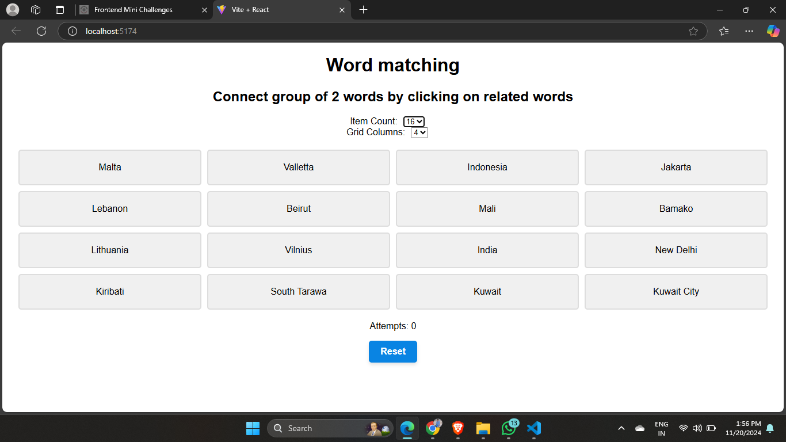

# Word Matching Game

## Overview

The Word Matching Game is an interactive web-based game built with React. The objective of the game is to match pairs of words (e.g., a country and its capital city). Players select two words at a time, and if they match, they stay visible in green. If they don't match, they turn red for a brief moment before returning to their initial state.

 

## Features

- **Matching Pairs**: Players must match pairs of related words (e.g., "Kuwait" and "Kuwait City").
- **Color Feedback**:
  - **Blue**: Words are highlighted when selected.
  - **Green**: Words turn green when a correct pair is matched.
  - **Red**: Words turn red when an incorrect match is made, and revert back after a short delay.
- **Configurable Settings**:
  - Players can change the number of items in the game and the grid columns via the configuration panel.
- **Attempts Tracking**: The number of attempts is tracked and displayed to the player.
- **Reset Button**: Players can reset the game to start over.

## Technologies Used

- **React**: JavaScript library for building user interfaces.
- **CSS**: For styling the game components.
- **React Hooks**: `useState`, `useEffect` for managing state and side effects.
- **Flexbox/Grid**: To lay out the game board dynamically.

## word-matching-game

├── /public
│ ├── index.html
├── /src
│ ├── App.js # Main game logic
│ ├── ConfigPanel.js # Settings panel for configuring game
│ ├── App.css # Styling for the game
│ ├── index.js # Entry point for React
├── package.json # Project configuration and dependencies
├── README.md # This file


### **Explanation of Sections:**

- **Overview**: Brief description of the game and how it works.
- **Features**: Key features of the game, such as the matching mechanism, feedback colors, and customizable settings.
- **Technologies Used**: List of tools and libraries used in the project.
- **Installation**: Instructions to clone, install, and run the game.
- **How to Play**: Step-by-step guide on playing the game.
- **Game Settings**: Explanation of the configuration options available to users.
- **File Structure**: Shows the structure of the project files.
- **Contributing**: Guidelines for anyone who wants to contribute to the project.
- **License**: Details about the project's open-source license.
- **Acknowledgments**: Recognizes inspiration and resources used in the project.

### **Image Placeholder**
- I've added an image placeholder (`image-placeholder.jpg`) under the `Overview` section. Replace this with your actual image or upload an image to the repository and update the link accordingly.

Let me know if you need any adjustments or further information!

## Installation

1. **Clone the repository**:
   ```bash
   git clone https://github.com/PankajKumarDhal/Word-Matching.git
   ```
